# 考情分析

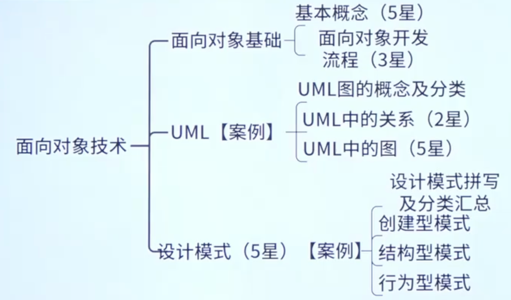

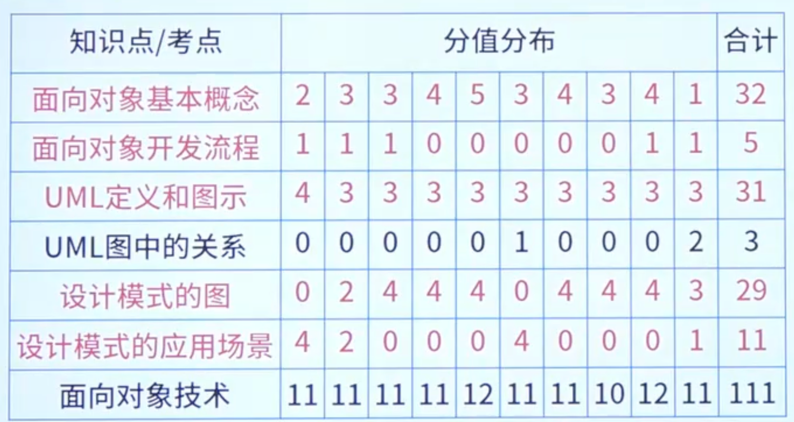

# 面相对象基础

## 基本概念

对象：属性（数据）+ 方法（操作）+ 对象ID

​	封装：隐藏对象的属性和实现细节，仅对外公开接口（信息隐藏技术）

类（实体类/控制类/边界类）

​	接口：一种特殊的类，它只有方法定义没有实现

集成与泛化：复用机制（单重继承和多重继承）

​	重置/覆盖（Overriding）：在子类中重新定义父类中已经定义的方法

​	重载：一个类可以有多个同名而参数类型不同的方法

多态：不通对象收到同样的消息产生不同的结果

​	过载多态：同一个名字在不同的上下文中所代表的含义不同

## 修饰符

权限排序（从最严格到最宽松）  private < default < protected < public

<table>
  <tr>
    <th>修饰符</th>
    <th>含义</th>
    <th>直接调用</th>
    <th>子类</th>
    <th>内部使用</th>
  </tr>
  <tr>
    <td>public</td>
    <td>公共的</td>
    <td>✅</td>
    <td>✅</td>
    <td>✅</td>
  </tr>
  <tr>
    <td>protected</td>
    <td>受保护</td>
    <td>❌</td>
    <td>✅</td>
    <td>✅</td>
  </tr>
  <tr>
    <td>private</td>
    <td>私有的</td>
    <td>❌</td>
    <td>❌</td>
    <td>✅</td>
  </tr>
  <tr>
    <td>default</td>
    <td>默认的</td>
    <td>❌</td>
    <td>❌</td>
    <td>✅</td>
  </tr>
</table>

## 面向对象开发流程

<table>
  <tr>
    <th>面向对象分析</th>
    <th>面向对象设计</th>
    <th>面向对象程序设计</th>
    <th>面向对象测试</th>
  </tr>
  <tr>
    <td>
      
认定对象（名词）

      
组织对象（抽象成类）

      
对象间的相互作用

      
基于对象的操作

    </td>
    <td>
      
识别类及对象

      
定义属性

      
定义服务

      
识别关系

      
识别包

    </td>
    <td>
      
程序设计范型

      
选择一种OOPL

    </td>
    <td>
      
算法层

      
类层

      
模板层

      
系统层

    </td>
  </tr>
</table>

## 面向对象设计7大原则

单一职责原则：设计目的单一的类

开放-封闭原则：对扩展开发，对修改封闭

里氏（Liskov）替换原则：子类可以替换父类

依赖倒置原则：要依赖于抽象，而不是具体实现；针对接口编程，不要针对现实编程

接口隔离原则：使用多个专门的接口比使用单一的总接口要好

组合重用原则：要尽量使用组合，而不是继承关系达到重用目的

迪米特（Demeter）原则（最好知识法则）：一个对象应当对其他对象有尽可能小的了解

## 面向对象设计其他原则

重用发布等价原则：重用的粒度就是发布的粒度

共同封闭原则：包中的所有类对于同一性质的变化应该是共同封闭的。一个变化若对一个包产生影响，则将对该包里的所有类产生影响，而对于其他的包不造成任何影响

共同重用原则：一个包里的所有类应该是共同重用的。如果重用了包里的一个类，那么就要重用包中的所有类

无环依赖原则：在包的依赖关系图中不允许存在环，即包之间的结构必须是一个直接的无环图形

稳定抽象原则：包的抽象程度应该和其稳定程度一致

稳定依赖原则：朝着稳定的方向进行依赖

# UML

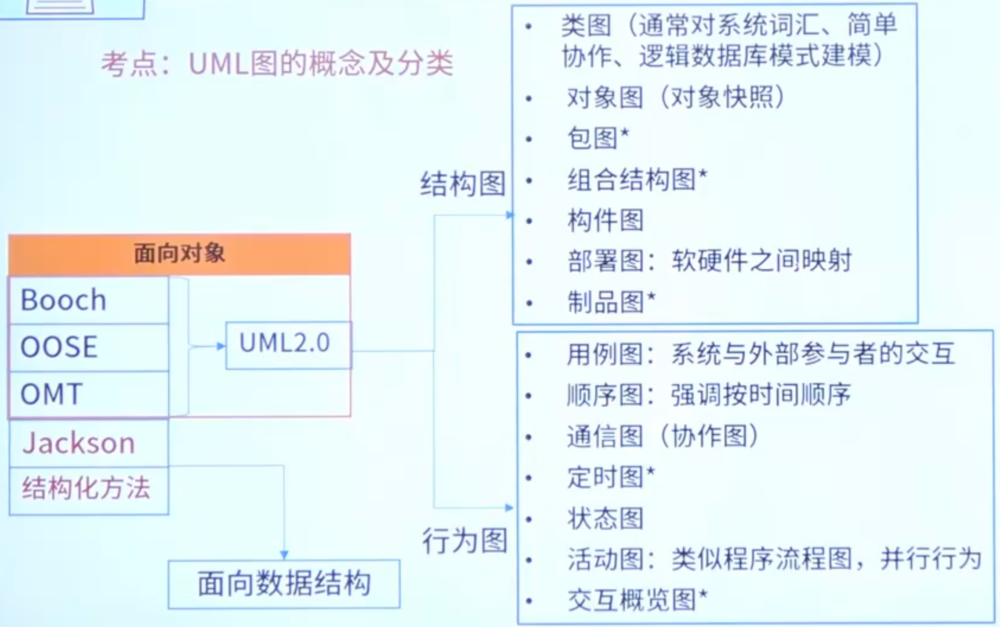

类图：一组对象、接口、协作和它们之间的关系

对象图：一组对象以及它们之间的关系（有冒号就是对象图，没有就是类图）

用例图：用例、参与者以及它们之间的关系（功能图）

序列图：场景的图像化表示，以时间顺序组织的对象间的交互活动

通信图：强调收发消息的对象之间的组织结构

状态图：展现了一个状态机，由状态、转换、事件和活动组成

活动图：专注于系统的动态视图，一个活动到另一个活动的流程

组件图：一组构件之间的组织和依赖，专注于系统的静态实现视图

部署图：运行处理节点以及构件的配置，给出体系结构的静态实施视图（唯一和硬件有关的）

## 类图中的关系

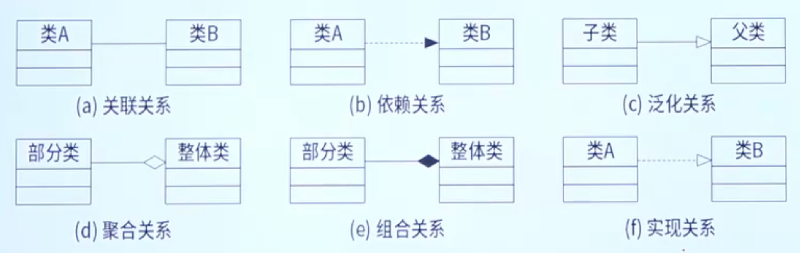

<table>
  <tr>
    <th>标题</th>
    <th>线段标识</th>
    <th>含义</th>
    <th>备注</th>
  </tr>
  <tr>
    <td>关联关系</td>
    <td>一条直线</td>
    <td>类A和类B可以得到对应的对象</td>
    <td>
      
类A：getB()

      
类B：getA()

    </td>
  </tr>
  <tr>
    <td>依赖关系</td>
    <td>虚线实心箭头</td>
    <td>类A的某个方法需要用到类B</td>
    <td>xx(B)</td>
  </tr>
  <tr>
    <td>泛化关系</td>
    <td>实线空心箭头</td>
    <td>记得空心箭头是儿子和爸爸就行</td>
    <td></td>
  </tr>
  <tr>
    <td>聚合关系</td>
    <td>实线空心菱形</td>
    <td>有聚有散，可以一聚在一起，也可以分开独立，只要记住菱形是一对多关系就行</td>
    <td>B类里有个A[]</td>
  </tr>
  <tr>
    <td>组合关系</td>
    <td>实线实心菱形</td>
    <td>只能组合在一起，分开不能独立，只要记住菱形是一对多关系就行</td>
    <td></td>
  </tr>
  <tr>
    <td>实现关系</td>
    <td>虚线空心箭头</td>
    <td>记得空心箭头是儿子和爸爸就行</td>
    <td></td>
  </tr>
</table>

## 用例图中的关系

用例就是功能

包含关系：当可以从两个或两个以上的用例中提取公共行为时应该使用包含关系来表示它们，其中这个提取出来的公共用例称为抽象用例，而把原始用例称为基本用例或基础用例。

扩展关系：如果一个用例明显地混合了两种或两种以上的不同场景，即根据情况可能发生多种分支，则可以将这个用例分为一个基本用例和一个或多个扩展用例，这样使描述可能更加清晰。

泛化关系：当多个用例共同拥有一种类似的结构和行为的时候，可以将它们的共性抽象成为父用例，其他的用例作为泛化关系中的子用例。在用例的泛化关系中，子用例是父用例的一种特殊形式，子用例继承了父用例所有的结构、行为和关系。

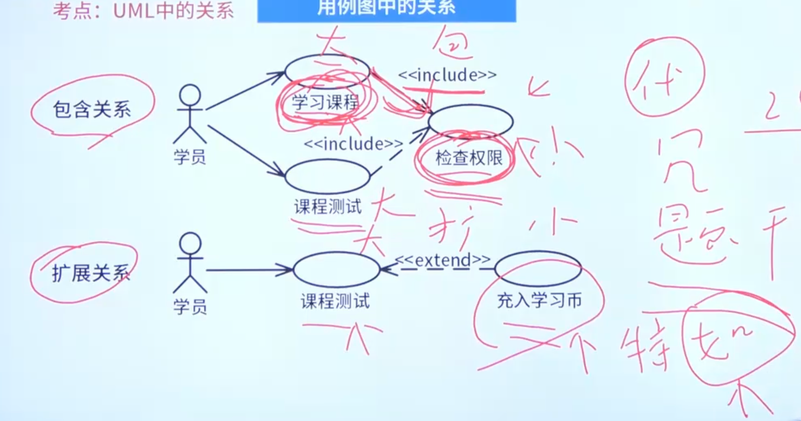

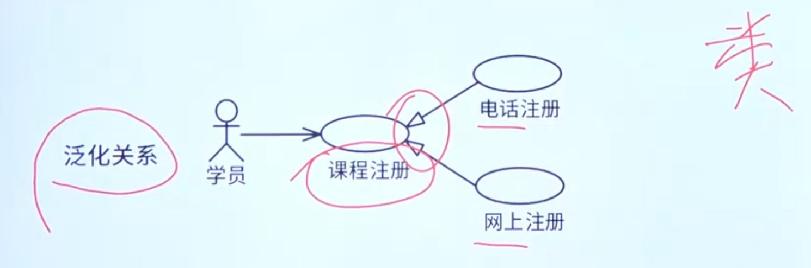

## UML中的图

### 类图

类图（class diagram）：类图描述一组对象、接口协作和它们之间的关系。在OO系统的建模中，最常见的图就是类图。类图给出了系统的静态设计图，活动类的类图给出了系统的静态进程视图。

### 对象图

对象图（object diagram）：对象图描述一组对象及它们之间的关系。对象图描述了在类图中所建立的事物实例的静态快照。和类图一样，这些图给无系统的静态设计视图或静态进程视图，但它们是从真是案例或原型案例的角度建立的。

### 用例图

用例图：描述了一组用例、参与者及它们之间的关系。

用例之间的关系包扣：包含关系、扩展关系、泛化关系

用例图建模流程：

​	识别参与者（必须）

​	合并需求获得用例（必须）

​	细化用例描述（必须）

​	调整用例模型（可选）

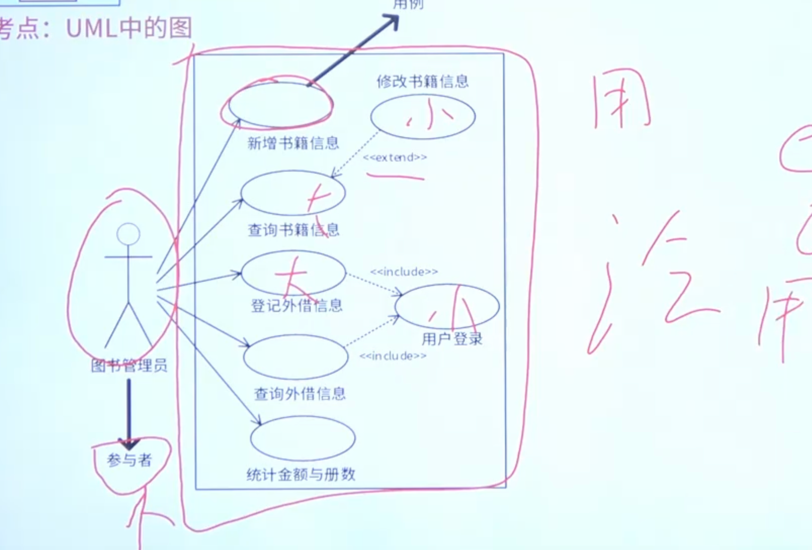

### 顺序图

顺序图（sequence diagram，序列图）：顺序图是一种交互图（interaction diagram），交互图展现了一中交互，它由一组对象或参与者以及它们之间可能发送的消息构成。交互图专注于系统的动态视图。顺序图是强调消息的时间次序的交互图。

​	实线箭头：调用消息

​	虚线箭头：返回消息

​	备注：以（）为标准

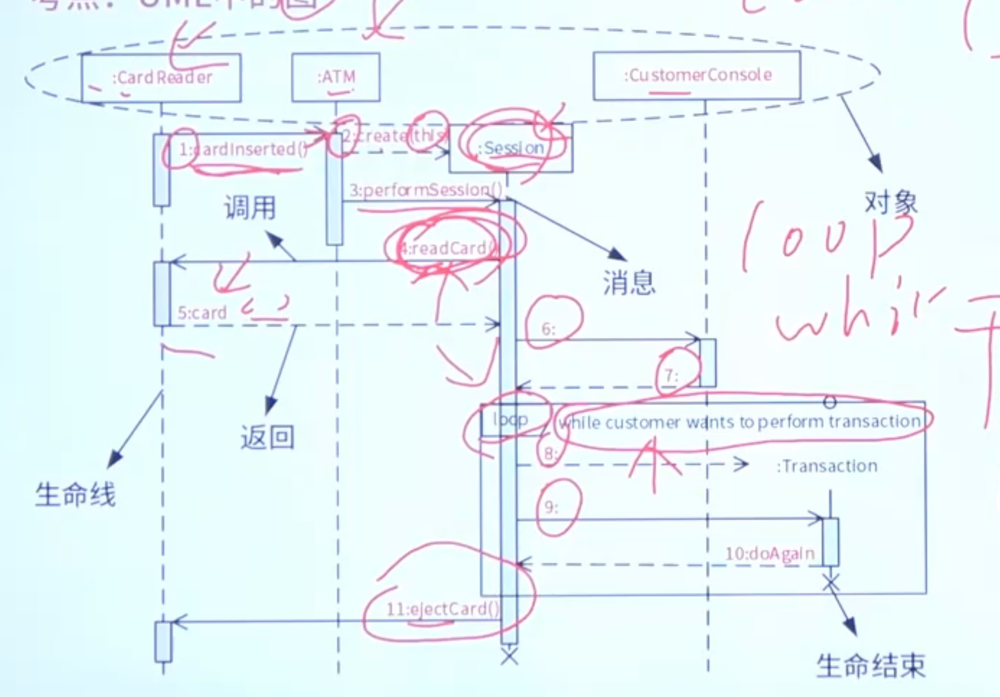

### 通信图

通信图（communication diagtam）：通信图也是一种交互图，它强调收发消息的对象或参与者的结构组织。顺序图和通信图表达了类似的基本概念，但它们所强调的概念不同，顺序图强调的是时序，通信图强调的时对象之间的组织结构（关系）。

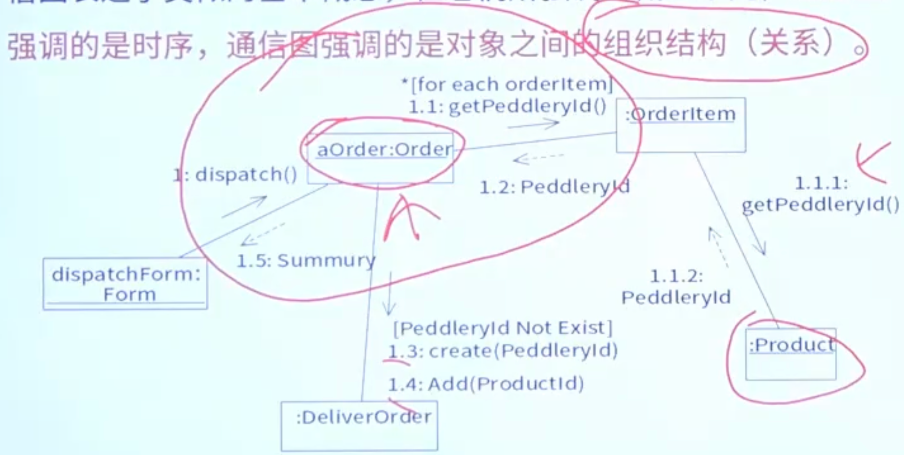

### 活动图

活动图（activity diagram）：活动图将进程或其他计算结构展示为计算内部一步步的控制流和数据流。活动图专注于系统的动态视图。它对系统的功能建模和业务流程建模特别重要，并强调对象间的控制流程。

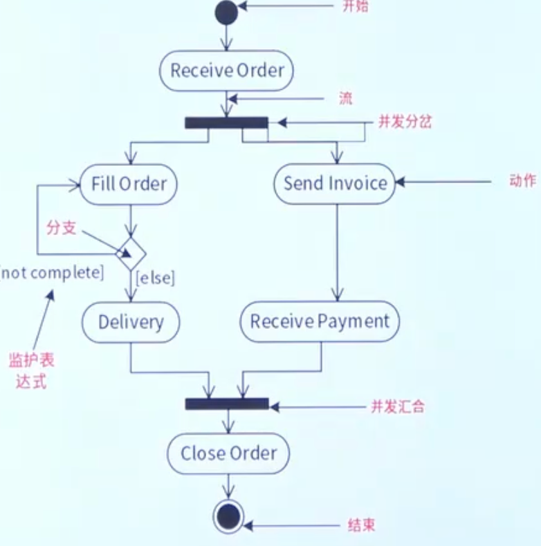

### 状态图

状态图（state diagram）：状态图描述一个状态机，它由状态、转移、事件和活动组成。状态图给出了对象的动态视图。对于接口、类或协作的行为建模尤为重要，而且它强调事件导致的对象行为，这非常有助于对反应式系统建模。

状态图由以下五部分进行构成：一般状态（起始状态，终止状态）、事件、监护条件、动作，转移（又叫转换）

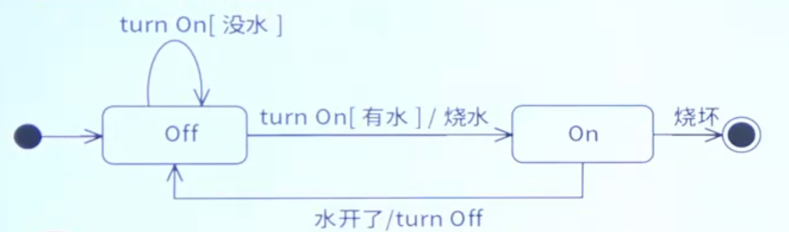

### 构件图

构件图（component diagram）：构件图描述一个封装的类和它的接口、端口，以及由内嵌的构件和连接件构成的内部结构。构件图用于表示系统的静态设计实现视图。对于由小的部件构建大的系统来说，构件图是很重要的。构件图是类图的变体。

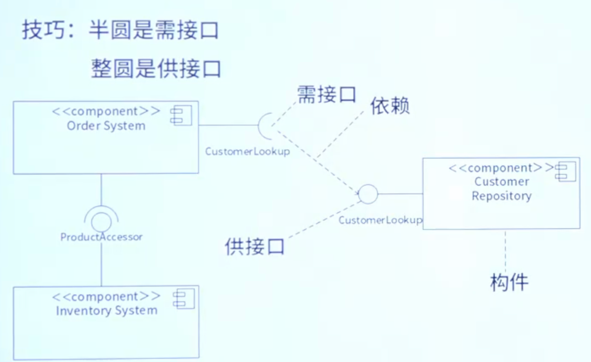

### 部署图

部署图（deployment diagram）：部署图描述对运行时的处理节点及在其中生存的构件的配置。部署图给出了架构的静态部署视图，通常一个节点包含一个或多个部署图。

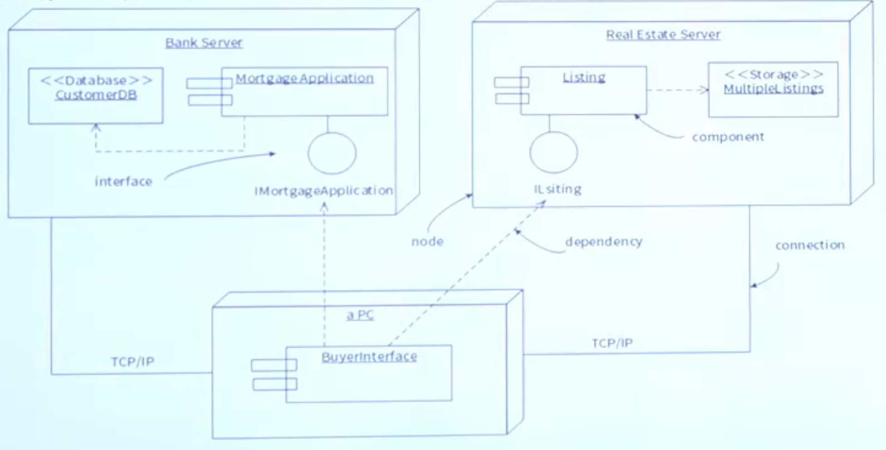

# 设计模式

口诀：公司模姐、四桥组装外箱带

<table>
  <tr>
    <th></th>
    <th>创建型 5</th>
    <th>结构型 7</th>
    <th>行为型 11</th>
  </tr>
  <tr>
    <td>类</td>
    <td>工厂方法模式</td>
    <td>适配器模式</td>
    <td>
      
模板方法模式

      
解释器模式

    </td>
  </tr>
  <tr>
    <td>对象</td>
    <td>
      
抽象工厂模式

      
原型模式

      
构建器模式

      
单例模式

    </td>
    <td>
      
桥接模式

      
组合模式

      
装饰器模式

      
外观模式

      
享元模式

      
代理模式

    </td>
    <td>
      
命令模式

      
中介者模式

      
备忘录模式

      
观察者模式

      
状态模式

      
策略模式

      
访问者模式

      
责任链模式

      
迭代器模式

    </td>
  </tr>
</table>

## 抽象工厂模式

提供一个接口，可以创建一系列相关或相互依赖的对象，而无需指定它们具体的类。

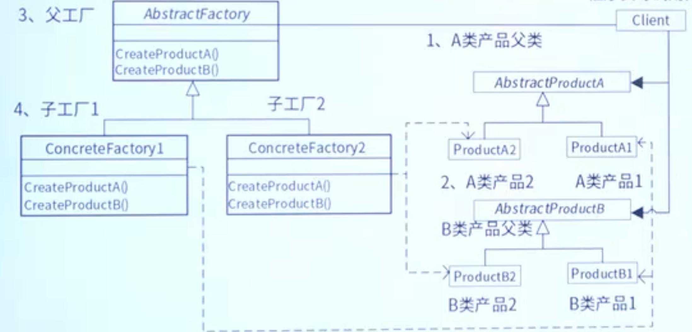

## 工厂方法模式

定义一个创建对象的接口，但由子类决定需要实例化哪一个类。工厂方法使得子类实例化的过程推迟。

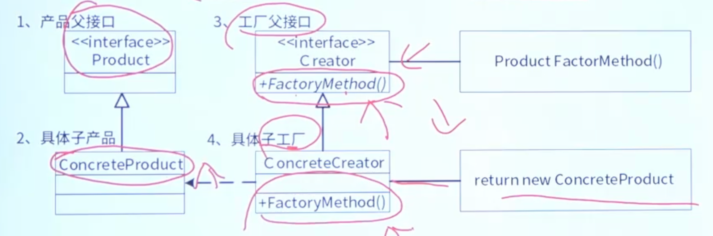

## 原型模式

用原型实例指定创建对象的类型，并且通过拷贝原型来创建新对象。

## 单例模式

保证一个类只有一个实例，并提供一个访问它的全局访问点。

## 生成器（构建器）模式

将一个复杂类的表示与其构造相分离，使得相同的构建过程能够得出不同的表示。

## 适配器模式

将一个接口转换成用户希望得到的另一种接口。它使原本不相容的接口得以协同工作。

## 桥接模式

将抽象部分与它的实际部分分离，使它们可以独立的变化。

## 组合模式

将有层级关系的多个对象组合成树型结构以表示“整体-部分”的层次结构，使得用户对单个对象和组合对象的使用具有一致性。

## 装饰器模式

动态的给一个对象添加一些额外的职责、功能。它提供了用子类扩展功能的一个灵活的替代，比派生一个子类更加灵活。

## 外观（门面）模式

为子系统中的一组接口对外提供一个唯一的接口，从而简化了该子系统的使用。

## 享元（轻量级）模式

提供支持大量细颗粒度对象共享元对象的有效方法。

## 代理模式

为对象提供一个代理，通过代理访问这个对象。

## 观察者模式

定义对象间的一种一对多的依赖关系，当一个对象的状态发生改变时，所有依赖于它的对象都得到通知并被自动更新。

